# FarmSim gameplay and visual overhaul audit

Date: 2026-10-02. Scope: current working tree, active web app, native iOS application source and GameCore, shared content/save contracts, and the older web game’s integration boundaries.

## Verdict

**Repair the playable baseline, rebuild the repeatable economy and progression, then make the farm itself communicate those systems.** The existing painterly artwork and warm palette are useful foundations. The current web experience combines a small working simulation with presentation data that often does not describe that simulation. The native game has more systems, but different rules and several reward-integrity defects.

This is an audit and an implementation backlog, not an implemented overhaul. Existing application edits were preserved. Both application builds currently fail. Some visual and interaction findings below come from an explicitly isolated diagnostic copy; they do not establish that the original app works.

## Evidence and limits

- Skills/plugins used: Game Studio’s `game-playtest`, Product Design’s `audit` and its context/framework instructions, and Unified Computer Use’s in-app browser.
- Actual app entry: `web/src/main.tsx` mounts `web/src/App.tsx`. It does not mount the older `components/farm-sim/core/FarmSim.jsx` game.
- Web lockfile: React 19.2.8, Vite 8.2.0, TypeScript 7.0.2, Vitest 4.1.10. These are repository observations, not upgrade recommendations.
- Current web browser checks used a separate local origin on port 5186. The diagnostic copy used port 5187 and separate browser storage.
- Diagnostic copy changed only three collection expressions: the overview’s plot `.length` and `.filter`, and the planner’s plot `.filter`, to use `Object.values`. No gameplay, CSS, art, or pricing was changed. See [diagnostic-preview.json](diagnostic-preview.json).
- Captures: 1280×720 desktop, 1366×900 desktop, and 390×844 mobile; some captures use full-page height. All saved screenshots were opened and inspected. Blank baseline captures are blocker evidence, not accepted healthy screens.
- Native app build failure prevented a current native runtime/visual audit. Native findings are identified as source findings. No stale simulator build was presented as current evidence.
- This was targeted system and journey coverage, not a line-by-line review of every legacy module. Full VoiceOver, contrast measurement, physical-device energy/frame-time testing, native minigame playtesting, production PWA offline/update behavior, and a long-term human enjoyment study remain unverified.

## Verification results

| Check | Observed result | What it proves |
| --- | --- | --- |
| `npm run test` | 41 suites, 138 tests passed | Included tests pass; most broader feature tests exercise the older game |
| `npm run build` | Failed: five TypeScript diagnostics in Overview/Field Planning | Current web application is not buildable |
| Current browser startup + Fields | Blank screen; `state.plots.filter is not a function` | Both current routes crash |
| Current Barn → ship five wheat | Money $2,430 → $2,540; inventory 60 → 55 | Actual payout disagrees with displayed $2.20/unit |
| `swift test --package-path ios/GameCore` | 108 tests passed, zero failures | Native core package tests pass; app/UI integration is outside this gate |
| Current iOS simulator-target build | Failed at `GameStore.swift:2028` | Current native app is not buildable |
| Diagnostic browser loop | Plant 12 wheat → water/advance four times → harvest; wheat 60 → 84; collect cheese → 1 cheese | Core crop/collection journey works after the isolated collection-access corrections |
| Diagnostic browser refresh | Money, wheat, cheese persisted; Market focus returned to Barn | Canonical progress persisted for this journey; subtab context did not |
| Simulation probes | Confirmed price mismatch, fractional/NaN shipping, finite seeds/orders, fixed season, weak save validation, denied-storage exception | See [reproducible observations](simulation-observations.json) |

Run the probes from the repository root with `node docs/audits/2026-10-02/reproduce-simulation.mjs`. They execute temporary copies of the current TypeScript modules using Node’s type stripping; they do not edit the game or use a player’s save.

The build failures are present in the supplied working tree. This audit does not attribute authorship or claim they are failures introduced by this work.

## What is actually connected

| Area | Active web | Native iOS | Overhaul implication |
| --- | --- | --- | --- |
| Farming | Three hardcoded crops, 30 plots/19 available, whole-field actions | Shared crop definitions, tile actions, growth multipliers | Choose common rules; preserve platform-specific input |
| Time | Explicit Advance day; no season update | Automatic days, default 1,440 seconds/day, offline catchup | Resolve session pacing and pause/catchup policy first |
| Water | Required for growth, except rain | Base growth always; watering adds 0.5 growth | These are different games mechanically |
| Economy | Three finite orders, no seed buying, no spending action | Seed buy/sell, upgrades, daily price changes | Web needs a complete replenishment/reinvestment loop |
| Production | Three recipes, five-job limit, all jobs advance together | No equivalent full processing queue identified in current Town flow | Define facilities and reservation rules before expanding recipes |
| Progression | Fixed inaccessible plots, no XP/unlock/upgrade actions | XP, buildings, research, specialization, prestige | Select a small coherent progression path; do not port all menus at once |
| Livestock | Fixed egg/milk accumulation and caps | Purchase/capacity model; collection grants immediate money | Give both versions one inventory/production contract |
| Fishing/pets/genetics | Older web code exists, disconnected from active entry | Current sections and store intents exist | Audit native transactions before porting |
| Audio/onboarding/settings | Older implementations exist; active entry does not connect them | Current native systems exist | Recover selected behavior deliberately |
| Art | Painterly backgrounds, item atlas, crop stages | Grass/soil textures, crop emoji labels, SwiftUI panels | Share art identity and semantic states, not renderer code |
| Persistence | Web v2 envelope plus legacy migration | Native SaveCodec version 16 | Preserve saves; cross-platform save compatibility is not currently established |

Shared base catalogs already contain 32 crops, 35 decor items, six buildings, ten research items, seven hybrid recipes, five livestock types, five pets, eleven fish, fifteen challenges, and nine festivals. Catalog size is not evidence that these systems are playable in the active web game.

## Findings ordered by priority

P0 means a present build/entry blocker. P1 means a core workflow, progression, or integrity defect. P2 means a substantive gameplay/UX/visual issue. P3 means documentation or cleanup that should follow a stable contract.

### P0 — restore runnable applications

**FS-001 — Overview and Fields crash because plot storage is treated as an array.** Confirmed browser and build finding. `web/src/components/FarmOverview.tsx:37` and `:38`, `FieldPlanning.tsx:32`, versus `data.ts:75`. Reproduce by starting at the root or loading `#planning`. Use the existing plot selector or `Object.values` consistently; mount the actual App in regression coverage. Screenshots 01 and 13 record the blocker.

**FS-002 — Native app cannot compile.** Confirmed build finding. `ios/App/Sources/GameStore.swift:2028` has an incomplete `first(where:)` call: the closure closes, but the call does not before `?.id`. Repair the expression, then rerun the complete app build; the passing GameCore tests do not cover this source. Further app diagnostics could appear after this first syntax blocker is removed.

### P1 — close the loop and protect its state

**FS-003 — Displayed and paid wheat prices differ by 10×.** Confirmed in the original Barn and simulation probe. `web/src/data.ts:156` sets `price: 2.2` and `payoutPerUnit: 22`; `state.ts:175` pays the latter. The current unit test explicitly expects this wrong payout. Choose one authoritative integer-cent price and use it for labels, totals, and payouts. Five wheat at $2.20 must pay $11. Screenshots 02–03.

**FS-004 — The active web economy exhausts its resources and buyers.** Confirmed action inventory and probes. `data.ts:166` seeds only 78 total seeds; `FarmAction` contains no purchasing, seed recovery, contract generation, or money-spending action. All three initial orders can be filled from starter inventory; 30 subsequent days leave zero orders. All starter seeds can be consumed, leaving every crop at zero stock. Add seed supply, a repeatable sale outlet, order renewal, worthwhile spending, and an explicit recovery path. Order deletion must not permanently remove the only buyer without a replacement mechanism.

**FS-005 — Recommended crops and processed goods cannot be sold.** Confirmed source/journey finding. `data.ts:155` lists only wheat, eggs, and milk orders; the UI has no general sell action. Tomatoes, corn, cheese, bread, butter, grain, and wool have displayed prices but no usable sale outlet. Bread also consumes a separate `grain` inventory that wheat harvesting never produces. Connect every starter good to a real outlet or recipe and clarify wheat→grain conversion. Otherwise the recommended tomato crop leads to stranded inventory.

**FS-006 — Shipment quantities can break integer inventory invariants.** Confirmed browser and reducer probes. `BarnMarket.tsx:113` clamps range but does not require integers; `state.ts:177` does not reject fractional/nonfinite quantities. Entering `1.5` and shipping persisted 82.5 wheat and 58.5 remaining order units. Directly passing NaN contaminated money and inventory. Validate finite positive integers at the reducer boundary; UI constraints alone are insufficient. Screenshot 11.

**FS-007 — Save parsing accepts invalid state and mishandles future versions.** Confirmed probes. `storage.ts:39`, `:106`, and `:122` accept negative money/day/inventory, unknown crops, negative growth, and invalid plot IDs. A future envelope becomes a starter farm; App’s subsequent save effect can overwrite it. Validate IDs, quantities, phases, and envelope versions; retain unreadable data for recovery and decline unsupported versions explicitly. Do not erase recoverable progress while falling back.

**FS-008 — Storage access denial escapes the catch, and failed writes are silent.** Confirmed probe/source finding. `storage.ts:131` accesses `window.localStorage` while evaluating default arguments, before the load/save try blocks. A throwing storage getter aborts startup. `App.tsx:158` ignores the save function’s false result. Acquire storage inside protected code, preserve in-memory play, and display a persistent save warning with retry/export recovery.

**FS-009 — Native livestock collection is repeatable money creation.** Confirmed source finding; native runtime blocked. `GameStore.swift:1095` calculates income from animal counts, adds coins/XP, and leaves readiness/last-collection state untouched. `MarketLivestockSection.swift:70` exposes the action without a readiness gate. Once animals exist, repeated calls can repeatedly grant the same income. Accrue goods through simulation time and atomically consume a saved ready balance on collection; test repeated collection and reload.

**FS-010 — Short desktop view hides the primary field action.** Confirmed diagnostic visual/DOM finding. At 1280×720, the Plant button starts at y=741 and ends at y=785; the document is 899px high while `styles.css:319` sets root vertical overflow to hidden. Automation could force it into view, but the initial pointer experience is broken. Use a scrollable panel or persistent action footer and reserve space for navigation. Screenshot 05.

**FS-011 — Passing tests do not validate the active app.** Confirmed test/source finding. Broad smoke/regression suites import the older `farm-sim/core/FarmSim` and GameContext; active TS tests cover reducer/storage helpers but no mounted `App`. Add actual-entry smoke and browser journey coverage, plus native store/application integration tests. Keep useful legacy tests clearly labeled until migration is complete; do not delete them to make the numbers look cleaner.

**FS-012 — Web/native game rules and content are divergent.** Confirmed source finding. `web/src/data.ts` bypasses shared catalogs, while native `ContentRepository.swift` loads them. Web requires water; native `SimTickSystem.swift:7` supplies base growth plus a water bonus. Time, pricing, currencies, content IDs, and saves differ. Establish a platform-neutral rules/content contract and deterministic action vectors before implementing a shared overhaul. Separate platform UI from simulation rules rather than forcing both into one renderer.

### P2 — make decisions, rewards, and visuals coherent

**FS-013 — Native fishing rewards a different random encounter.** Confirmed source finding; native runtime blocked. `FishingView.swift:417` chooses the fish used for difficulty and visuals. On success, `:508` calls `GameStore.castFishingLine`, which chooses another fish at `GameStore.swift:1237`. Carry a saved/validated encounter ID through completion and award that fish exactly once. Also cancel cast/tick/result tasks on section disappearance and background transitions; the current view has no disappearance cleanup.

**FS-014 — Native research durations are advertised but unused.** Confirmed source finding. `MarketResearchSection.swift:90` displays `durationSeconds`; `GameStore.swift:988` spends coins and marks research complete immediately. Either implement timed research jobs with cancel/resume semantics, or describe immediate upgrades honestly. Validate the resulting effects rather than merely marking completion.

**FS-015 — The coach presents unsupported economic and weather certainty.** Confirmed diagnostic/source finding. `App.tsx:22` and `:50` score arbitrary projected-return/weather/season values, while the actual crop transition uses watering/rain only. The initial coach recommends Tomato, the next-action bubble says Wheat, and the selected card gets “Best fit” irrespective of recommendation. Clicking “Plant Tomato” only navigates; it does not select Tomato. `FieldPlanning.tsx` derives active growth text from the draft crop, so choosing Tomato while wheat grows changes 0/4 to 0/6. Derive estimates from actual rules, open a correctly selected draft, and show planted-crop status independently. Screenshots 04–08.

**FS-016 — Whole-field lock prevents staggered planting and useful spatial choices.** Confirmed diagnostic/source finding. `App.tsx:171` forbids planting if any plot is planted; `FieldPlanning.tsx:79` disables every plot during a crop run, including seven empty available plots after the default planting. The reducer already supports planting valid free plots. Support individual selection/batch actions without globally locking the farm. Add mixed-crop selectors and truthful per-plot inspection before enabling it.

**FS-017 — Tasks are a fixed checklist rather than a reliable objective system.** Confirmed source/journey finding. `FarmOverview.tsx:32` caps watering at 12, marks planting from current occupancy, and ships from lifetime `shippedGoods`; growth/day changes do not reset objective progress coherently. Harvesting loses the planting achievement, empty fields still receive a “Water 12” task, and the egg task becomes complete whenever the ready balance is zero. Use objective IDs, targets appropriate to the current farm, eligibility, daily progress/events, completion rewards, and renewal rules. Screenshot 12.

**FS-018 — Seasons do not advance; most crop condition labels are decorative.** Confirmed probe/source finding. Advancing 100 days leaves Spring at day 112. Season-fit/water-need/projected-return labels are static, and each crop receives the same one-day growth from watering. Introduce a shared season calendar and a small number of legible crop tradeoffs, or remove labels that imply mechanics. For twelve plots, displayed catalog values imply 24 wheat/$52.80, 36 tomatoes/$122.40, or 24 corn/$67.20 gross at item-card prices—not the hardcoded $480/$720/$660. These are illustrative gross values, not profit, and tomatoes/corn still lack an outlet.

**FS-019 — Production queue is not a facility queue and displays misleading timers.** Confirmed source/journey finding. `data.ts:183` starts with “Ready in 1h 20m” and “2h 50m”; there is no hourly timer. `state.ts:20` advances every item by 0.5 per day, including queued jobs, and `status` quantities are stale display strings rather than output quantity truth. Define machine capacity, parallel/serial rules, recipe duration, and remaining time from canonical job state. Screenshot 02 versus screenshot 09.

**FS-020 — Cancellation loses paid inputs without explanation.** Confirmed probe. Starting cheese consumes two milk; cancelling leaves milk at 16 rather than the previous 18 (`state.ts:196`). Choose a refund/partial-refund policy, disclose the consequence, and support undo or confirmation when value is forfeited. Deleting finite orders also needs an explicit consequence.

**FS-021 — Homestead illustration misrepresents farm state.** Confirmed diagnostic visual/source finding. `styles.css:92` paints a fixed image containing mature fields even when the farm has zero planted plots. `FarmOverview.tsx:93` changes one decorative highlight at the 12-plot threshold; it does not render actual crops, readiness, yield, or buildings. Build state-driven plot/building/animal layers anchored to stable world coordinates. Keep the illustration as scenery. Screenshots 04 and 12.

**FS-022 — Mobile hides the context needed to plan.** Confirmed diagnostic screenshot/DOM finding. At 390px, `styles.css:366` hides day/season values and the weather control. The remaining calendar/leaf chips communicate no visible values, and weather is unavailable in the header. Retain a concise readable day/season/forecast row and accessible names. Screenshot 08.

**FS-023 — Mobile layout prioritizes panels over the farm and active action.** Confirmed diagnostic visual/DOM finding. The Homestead task card occupies most of the screen; the harvest action is at y=1,320 beneath the comparison cards, even when all plots are ready. Barn places inventory before ready production; Market places a static trend panel before orders. Navigation is fixed over content, and the toast covers it in screenshot 11. Lead each state with the active action, collapse secondary detail, reserve overlay space, and use a compact task tray. Screenshots 08–12.

**FS-024 — Accessibility has useful foundations but incomplete interaction semantics.** Confirmed DOM/source checks, with full assistive-technology testing pending. Real buttons, plot names, live announcements, focus styles, and reduced-motion CSS exist. Market arrow-left leaves the selected Market tab unchanged; both tabs have tabindex 0, no roving keyboard interaction, and no tab IDs/tabpanel labeling link. On mobile Market, the only h1 is in the hidden Barn column. Ship/delete controls measure 27×27px: especially risky for neighboring actions on touch, although this alone is not a claim of WCAG failure. Add robust tab behavior or simpler button semantics, a visible Market heading, larger separated targets, and a skip link. Native SpriteKit tiles expose touch handlers but no tile accessibility model was found; test/provide VoiceOver actions and an accessible farm list. See [keyboard/target observations](keyboard-and-target-observations.json).

**FS-025 — Native art does not share the web game’s visual language.** Source finding only. `FarmScene.swift:393` uses crop emoji labels over textured rectangles; most crop distinctions use emoji instead of the web’s painted stage art. Native assets currently include grass, soil, menu background, and app icon, without an equivalent full crop atlas. Replace crop/world emoji with authored sprites, preserve native symbol icons for controls, and use shared stage/anchor metadata. Verify native screenshots before judging final composition or HUD weight.

**FS-026 — First-session progression and sensory payoff are missing from the active web app.** Confirmed active dependency/action inventory. The player begins at day 12 with $2,430, stocked inventory, partly completed production, and preselected plots. This is useful as a demo fixture but gives no earned context, introduction, farm identity, or upgrade goal. Legacy onboarding/audio/settings exist but are disconnected. Add an intentional new-game start and short guided first contract; connect optional sound, action feedback, and visible upgrades to the core loop. Preserve the demo fixture separately for QA.

**FS-027 — Navigation context is transient and Back does not represent the journey.** Confirmed source/refresh finding. `App.tsx:163` uses replaceState for every screen; Barn/Market focus is local React state rather than URL state. Refresh on Market returns to Barn. Completed task links do not set Market/collection focus. Use navigable URL state for screens/subtabs, meaningful task destinations, scroll/focus restoration, and normal history. Avoid redesigning the routing stack solely for this fix.

### P3 — restore project truth and release discipline

**FS-028 — Documentation and parity records describe different generations.** Confirmed source finding. README advertises FarmLife 4.2/React 18/Vite 4/Tailwind while the active lockfile differs. The shared save contract says version 5; native codec says 16; web uses its own v2 envelope. The parity checklist refers to the older web entry. Older rehaul notes claim a blank workspace and completed gates that do not describe this working tree. Preserve those notes as historical; add a current product/system inventory, exact supported save contracts, active build commands, and a baseline QA table.

**FS-029 — Release tooling and performance evidence need to follow the active app.** Confirmed script/test inventory; production behavior unverified. Root scripts expose commands absent from web/package.json, including test:ui/coverage/watch, smoke-test, and test:e2e. “lint” only typechecks. Existing web performance budget tests exercise the older FarmingSystem rather than the active app. After stabilization, define working active-entry checks, targeted native store/UI checks, asset/loading budgets, production offline/update tests, and renderer profiling on representative devices. Pin deliberate dependency ranges from the verified lockfile; do not combine an overhaul with speculative framework upgrades.

## What to retain

- Painterly rural atmosphere, parchment/forest/sage/gold palette, and restrained display typography.
- The crop-stage atlas and item atlas as initial assets, subject to readable scale/crop checks.
- Pure reducer transitions, ID-based state, atomic shipping/one-time web collection foundations, and explicit error messages.
- Native GameCore, versioned codec, atomic file writes, intent/store boundary, and renderer dirty-tile updates.
- Shared catalogs as content inputs after consistency validation.
- Useful existing tests; distinguish active, legacy, shared-contract, and native integration coverage.

Do not delete the legacy game or its saves until needed systems and migration paths have been accounted for. Do not add a backend, replace React/SwiftUI/SpriteKit, or force a 3D conversion to solve the identified problems; none is required by this evidence.

## Recommended gameplay direction

**A small farm restoration game built around purposeful farm days and visible reinvestment.** This is a proposed direction, not an approved product requirement.

The repeated loop should be: choose a reachable goal → acquire supplies → plant a useful mix → care for the farm → grow/harvest → sell or process for a visible tradeoff → fulfill a contract → improve the farm → choose the next goal.

1. Start with a small, partly neglected farm and enough seeds to earn the first sale. Provide an optional short demonstration save.
2. Give crops distinct useful roles: a quick staple for reliable cash, a slower valuable crop, and a crop that feeds a recipe or animal system. Derive numbers from actual costs, yields, duration, and buyers.
3. Keep ordinary sales always available; rotating contracts reward planning rather than gate the entire economy. Add repeatable seed buying and a gentle recovery mechanism.
4. Give the first earnings a visible purpose: restore a plot, repair a coop, or unlock one processing building. Tie unlocks to the world rather than a wall of disconnected tabs.
5. Make water/forecast/season decisions legible. Avoid adding disease, disasters, social features, prestige, and dozens of multipliers until the small loop is enjoyable and balanced.
6. Separate farm work from optional fishing/pets/collection play. Add these after they produce consistent rewards and cleanly pause/cancel.
7. Resolve time explicitly. Recommended first overhaul slice: player-controlled farm days with a “finish day” summary and clear pending work; both platforms share deterministic day rules. If a real-time idle game is preferred, define one shared clock, pause behavior, catchup cap, and honest job timers instead. The current 24-minute native day versus instantaneous web day must not remain an accidental platform difference.

### First-session and return-session acceptance proposals

- A new player identifies the next action without external instructions, earns a first meaningful sale, buys replacement supplies, and sees a farm improvement.
- Playing at least 30 simulated days leaves viable crop/seed/sales paths; no mandatory action consumes the last recovery route.
- At least two crop/recipe strategies have valid contextual uses; coach advice is explainable by real state and available buyers.
- A returning player sees completed production, farm needs, one reachable goal, and a clear resume action.
- The player can postpone optional activities and keep farming without clearing a stack of overlays.

## Recommended visual overhaul

### World and art

Use one coherent painterly 2.5D farm world with clean readable interactive layers. Build a scenery plate without baked crops, then place crops, restored plots, buildings, animals, paths, and readiness markers from canonical state. Share subject proportions, perspective, light direction, palette, and stage metadata across web/native, while each platform retains its appropriate renderer.

Produce assets in this order: neutral farm scenery → soil/plot states → three starter crop stage sets → one upgradeable barn/coop/facility → animal idle/collect states → small payoff effects → seasonal scenery variants. Validate actual small-screen slots before generating a large catalog. Keep asset provenance, licensing, source masters, exports, anchor points, and atlas metadata with each admitted asset.

### Screen hierarchy

| Surface | Main focus | Supporting UI | Acceptance proposal |
| --- | --- | --- | --- |
| Farm | State-driven world and direct plot/building interactions | Compact day/season/weather/cash, one task tray | Farm remains visible on phone; current state is understandable without opening a separate dashboard |
| Fields | Selected/active plots and the action appropriate to their state | Crop choice in a collapsible tray; real economics | Plant/water/harvest stays reachable above navigation at representative heights |
| Barn | Ready goods and active facilities | Inventory filters/details | Collecting or starting a job does not require reading every stored item |
| Market/Town | Buy supplies, fulfill/sell, choose one improvement | Real prices/forecast; optional trends only with data | Correct total preview, usable buyer for starter outputs, no destructive neighboring controls |
| Native optional sections | One activity at a time | Goal/reward context | Encounter and reward match; navigation cancels active work cleanly |

Use display type for titles and readable body/numeric text for rules and controls. Reduce tiny coach/stat rows and repeated recommendations. Keep available/selected/watered/ready/blocked states legible using shape, text, and icons as well as color. Make harvest effects and upgrade reveals reinforce the action without hiding the next task. Make audio optional and reduced motion respected.

## Implementation order and release gates

A detailed checklist is in [BACKLOG.md](BACKLOG.md). Work in narrow slices with observable outcomes, not one all-at-once rewrite.

1. **Restore baseline:** repair both build blockers; test mounted active entry and native app target. Exit only when current builds and boot checks pass.
2. **Unify simulation rules and safety:** prices/quantities, saves/recovery, time/growth/content contract, native reward consumption. Exit when invalid actions and repeat collection cannot corrupt state or duplicate rewards.
3. **Complete one renewable economy:** seeds, ordinary sales, contracts, crop/recipe connections, one visible upgrade. Exit when a 30-day journey can keep functioning and reinvesting.
4. **Rebuild core interactions:** mixed planting, truthful objectives/coach, facility queue, day summary, context/history/focus. Exit with end-to-end refresh-safe journeys.
5. **Rebuild visual world and responsive shell:** state-driven assets, compact mobile HUD/task tray, reachable actions, meaningful animation/audio. Exit with matched captures and interaction checks on both platforms.
6. **Add optional systems gradually:** native fishing/research/livestock fixes first; then selected pets/genetics/season events, each with transactions and clear purpose.
7. **Release hardening:** migration fixtures, keyboard/VoiceOver, contrast/zoom/reduced motion, offline updates, representative-device performance and current documentation.

Do not assign calendar estimates until the clock direction, first platform milestone, and desired farm interaction style are settled. These are product decisions for implementation, not blockers to the completed audit.

## Numbered screenshot walkthrough

“Diagnostic” means the temporary collection-access correction described above. Each image below is from this audit run, not a mockup. Blank screens name the blocker. Viewport/full-page framing is preserved so layout defects remain visible.

### 01 — Current startup: blocked

Overview crashes before rendering controls (FS-001). See console evidence.

### 02 — Current Barn entry: usable, misleading economy and timers

Barn is directly accessible. Clear item icons and grouped controls are strengths; finite buyers, price mismatch, static trends, and unsupported hourly timers are material risks (FS-003–005, FS-019).

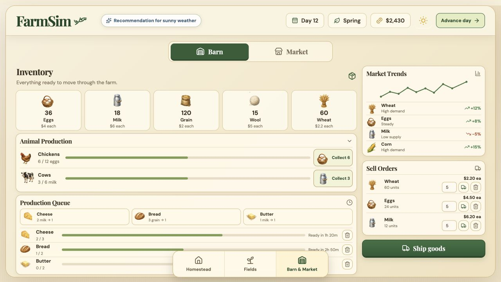

### 03 — Current five-wheat shipment: transaction works, payout incorrect

Inventory falls by five and money rises by $110 despite the displayed $2.20/unit (FS-003). Screenshot captured after the transient toast expired; before/after money and inventory plus the probe establish the mismatch.

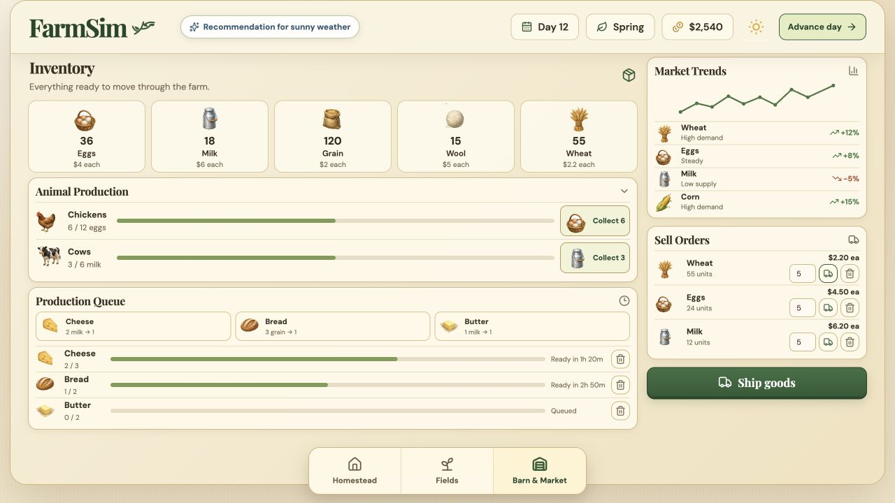

### 04 — Diagnostic Homestead desktop: attractive, conflicting guidance

The empty farm has mature fields in the background, Tomato coach advice, and a Wheat next-action bubble (FS-015, FS-021).

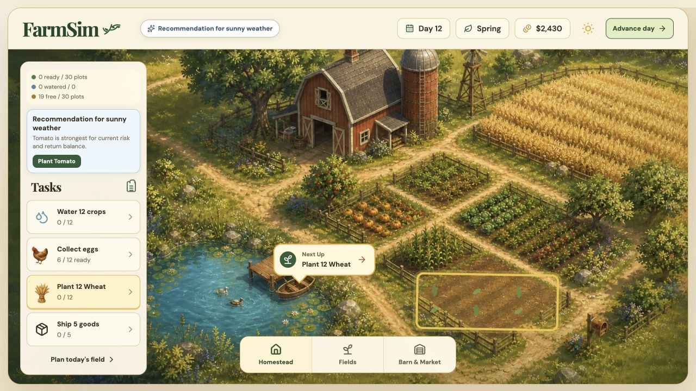

### 05 — Diagnostic Fields at 1280×720: action outside viewport

The planner offers useful named plot buttons, but the primary action is below the viewport and root scrolling is hidden (FS-010).

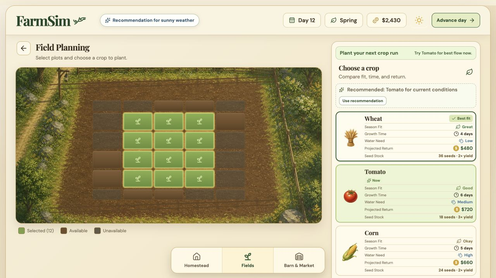

### 06 — Diagnostic planted wheat at taller desktop: simulation present, planning UI dominates

Small crop-stage sprouts reflect planting. Empty plots are globally disabled, recommendation remains visible, and the chooser pushes the action toward the bottom (FS-015–016, FS-023).

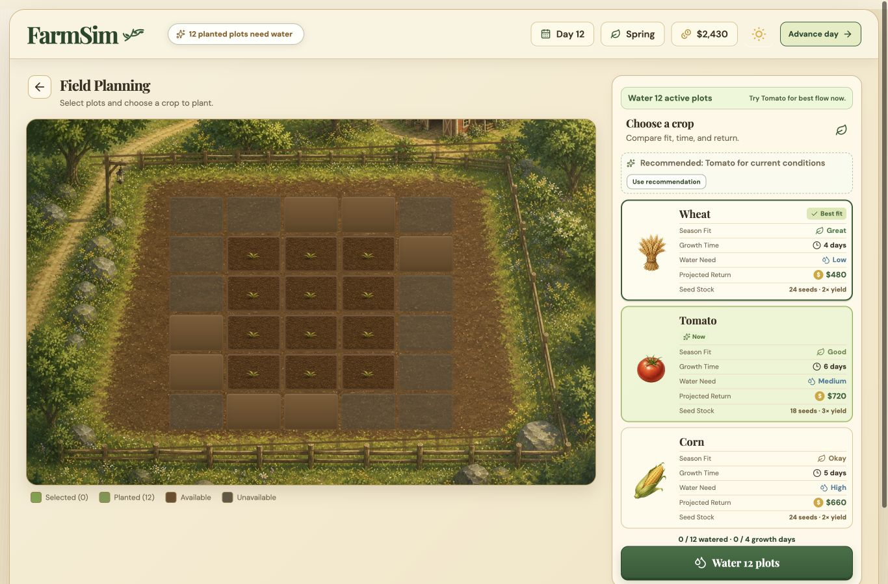

### 07 — Diagnostic harvest-ready state: readable readiness, draft/status conflict

After four water/advance cycles, twelve wheat plots are ready. The ready crops, checks, and harvest CTA are useful. Tomato remains selected/recommended despite the wheat crop (FS-015).

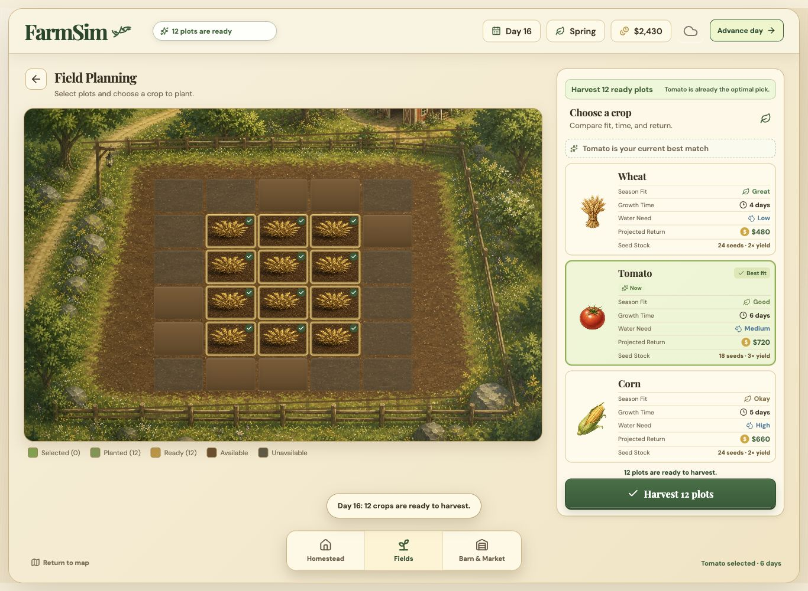

### 08 — Diagnostic mobile Fields: legible plots, harvest buried

At 390×844 there is no horizontal page overflow in this state. Day/season/weather values are missing; the action sits below the crop comparison cards (FS-022–023). Twelve wheat were subsequently harvested into inventory.

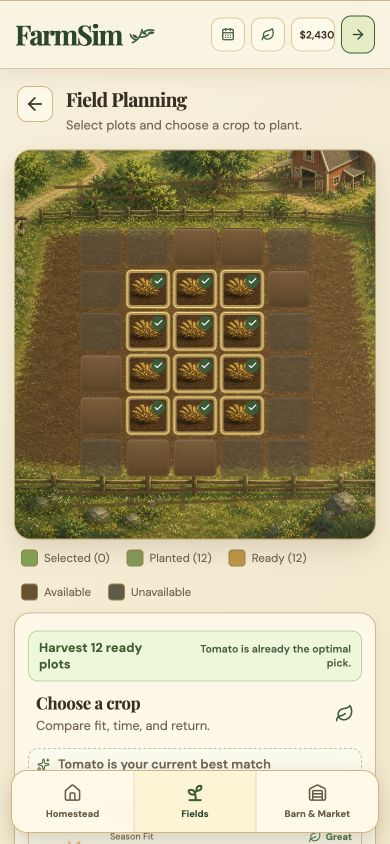

### 09 — Diagnostic mobile Barn after harvest, collection, shipment, and refresh: state survives, task order weak

Inventory shows 82.5 wheat after the later fractional shipment and one collected cheese after refresh. Ready production appears beneath a large inventory block (FS-006, FS-023). This final accepted full-page capture replaces earlier cropped framing.

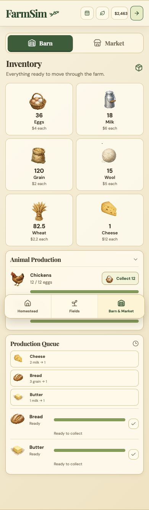

### 10 — Diagnostic mobile Market: sale available, decorative chart leads

Static trends precede actual orders. Labels and real controls help, but tiny neighboring ship/delete controls and the generic Wheat-only Ship goods action need revision (FS-005, FS-023–024).

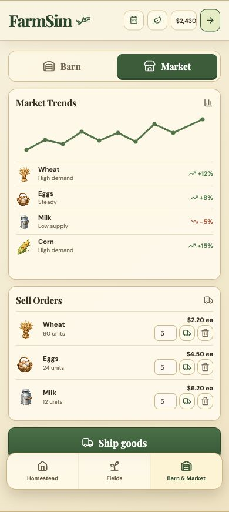

### 11 — Diagnostic fractional shipment: persisted integrity defect

Shipping 1.5 wheat pays $33 and leaves 58.5 order units. The toast covers navigation (FS-006, FS-023).

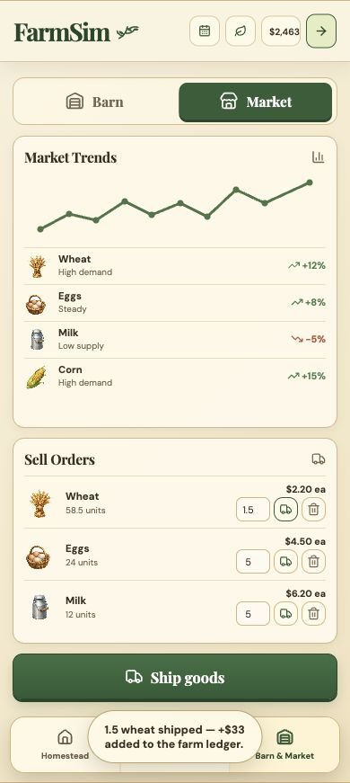

### 12 — Diagnostic mobile Homestead after harvest: tasks obscure the world

The farm is empty again but illustrated crops remain. A fixed Water 12 task still appears, and the task card occupies most of the viewport (FS-017, FS-021–023).

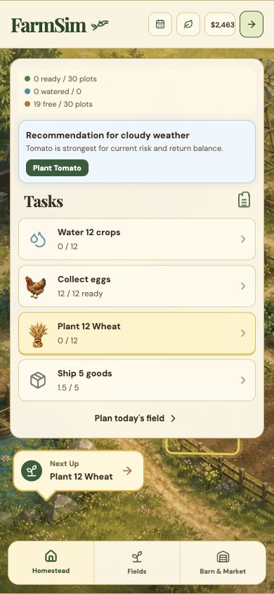

### 13 — Current Fields retest: blocked

Original source still fails at its plot filter. This retest confirms the diagnostic copy did not fix or replace the application (FS-001).

