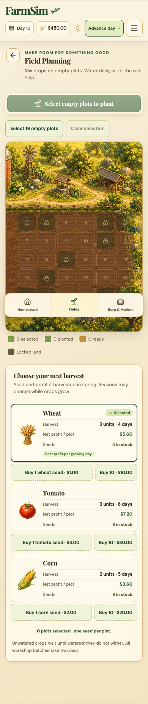
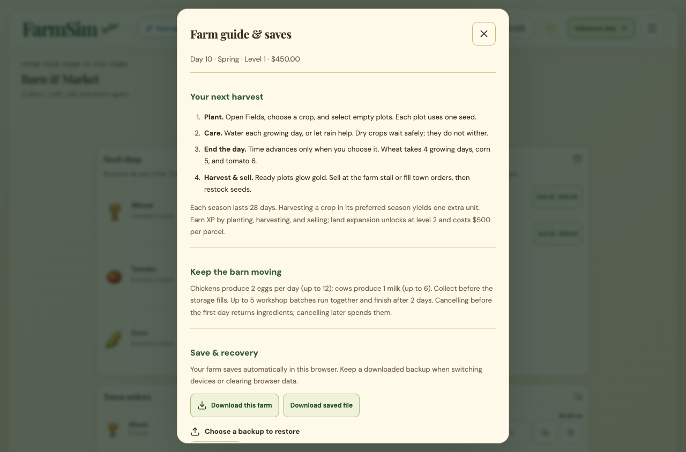
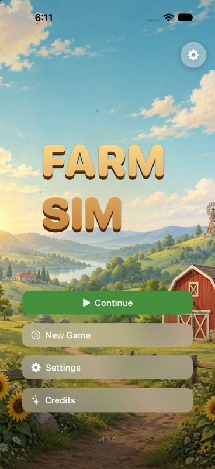
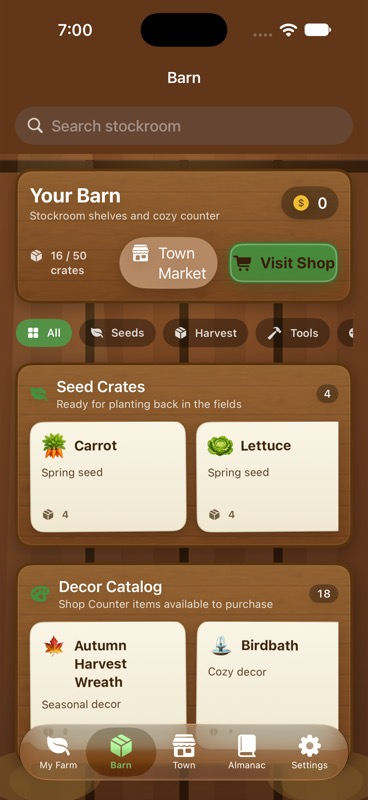
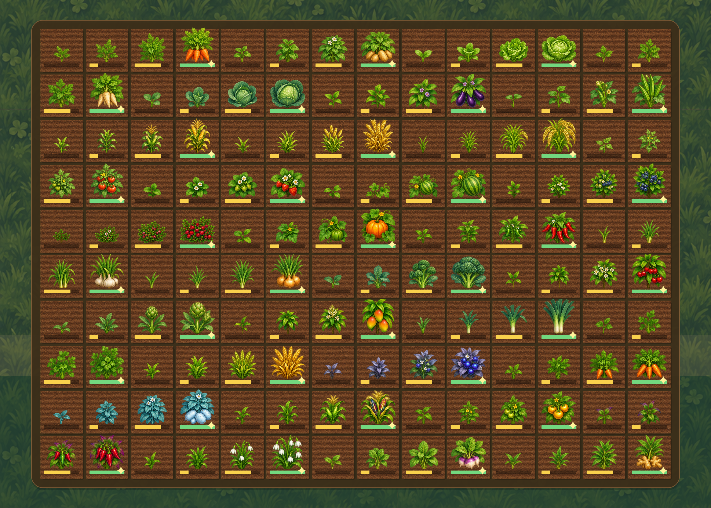

# Gameplay QA and improvements — 2026-10-02

This pass audits the active React application, native SwiftUI/SpriteKit source, and GameCore. It follows the earlier [overhaul](../../overhaul/2026-10-02/PROGRESS.md). Web version 0.3.1 is local and unpublished. The earlier audit and publication records are historical.

## Implemented findings

| Area | Finding and resulting behavior | Evidence |
| --- | --- | --- |
| Saves | One browser tab could overwrite another tab's progress. Compare the loaded save before writing, serialize cooperating writes with Web Locks, and pause conflicted sessions with download/reload recovery. | Reproduced before repair; regression tests; simultaneous clicks in two browser tabs preserved the saved day and warned the losing tab. |
| Recovery | The active game had no player-facing backup/restore workflow. Added a guide/save dialog, current and original-file downloads, strict v3 import validation, a preview and confirmation, and a recovery copy before replacing a save. Recovery filenames cannot collide in the same millisecond. | Valid backup preview and restore, invalid JSON rejection, real download event, storage-failure and collision tests. |
| Guidance | An empty seed box still led to planting advice. It now routes to the seed shop and explains the animal-goods recovery path. Seasonal profit labels state which harvest season their estimate assumes. | Mounted App regressions and rule review. |
| Field work | Added select-all-empty and clear-selection actions; occupied and locked plots remain excluded. Rain-watered homestead crops no longer offer redundant watering. | Reproduced rain issue before repair; App tests and browser farming journey. |
| Shop | Packs alone required unnecessary cash to resume planting. Added individual seed purchases alongside packs. | A $1 farm can buy one wheat seed; mounted App test and responsive browser inspection. |
| Workshop | Cancelling a started batch spent ingredients immediately. Added a modal confirmation explaining the loss and an option to keep the batch. Unstarted batches still refund ingredients. | Started-batch regression and actual browser cancellation/focus checks. |
| Navigation | Clicking a Barn/Market tab moved focus and scrolled to the main container. Tab changes now retain control focus and preserve the route. | Reproduced before repair; mounted test and browser route checks. |
| Accessibility/layout | Added named collection controls, native modal Escape/focus restoration, a file-input focus indicator, reduced-motion styling, responsive menu/warnings, and larger narrow-phone plot targets. | 320, 390, 768 and 1280 pixel viewport checks; 320-pixel plots measured at least 44.7 × 46.2 pixels. Modal tab navigation did not reach background game controls; browser chrome may take focus. |
| Offline startup | First-install offline reload returned blank HTML because the worker missed hashed JavaScript/CSS. Vite now emits a build manifest, and the worker precaches all runtime bundles before activating. Same-origin static assets match despite Origin-header variation; unrelated requests retain Vary semantics. Cache pruning is confined to FarmSim's namespace. | Blank cold reload reproduced; VM regression tests; fresh browser profile installed online, launched offline, planted/watered four crops, advanced to day 2, reloaded with growth preserved, and opened Market offline. |
| Native reward messages | Welcome-back XP and daily streak payouts were advertised without being granted. Welcome-back rewards now come from actual ledger deltas; streak celebrations describe continuity without invented coins/XP or confusing a coin amount with a day count. | Welcome-back discrepancy observed in simulator; store/event source tracing. |
| Native seed tray/research | Locked seeds crowded the first choices. Usable seeds now come first, with wheat at the front. Research displays Instant, matching its existing immediate purchase transaction. | Real-store seed-order tests and native Seed Shop/Research captures; complete optional-feature UI coverage remains limited as described below. |
| Native research benefits | Paid upgrades could record completion without delivering their advertised benefits. All ten supported research IDs now share an implemented numeric policy and truthful descriptions; unsupported IDs cannot charge coins. Irrigation actually waters crops, and composting, beekeeping and aquaponics apply their benefits. | Core and real-GameStore tests cover atomic purchases, prerequisites, repeat purchases/reload, discounts, growth, yields, honey, and fish rewards. |
| Native daily settlement | Cold catch-up advanced an already-advanced clock; multi-day silo sales settled once; milestone rewards could lag the published save. Clock alignment and per-day settlement now match active days, and chained rewards settle before UI/save publication. Bulk harvest counts capacity once. | Regressions reproduced before repair; isolated store tests compare active, fast-forward, cold startup, capacity boundaries, rewards and reload. |
| Native audio | Audio preparation shared the main actor with UI work, and saved mute settings were applied too late. A dedicated actor now owns synthesis/playback, with cancellable preparation and saved preferences applied before feedback. | Four app tests cover mute, cancellation, failure diagnosis and real synthesis preparation off the main thread. |
| Native artwork | Only three crops had growth art, and feature cards primarily used emoji. Ten new assets and shared measured regions cover all 35 crops/four stages, buildings, livestock, pets, fish, materials, menu and app icon. Crops retain proportions and upright controls. | Bundled-content coverage tests, the 140-stage native renderer, inspected generated sheets, and simulator captures. [Artwork provenance and coverage](../../art-source/ios-v4/README.md). |
| Native Market | The old narrow category strip and crowded wood rows obscured departments and transactions. Town now has a pinned department menu, four shortcuts, illustrated cream cards, usable-seed filtering, and explicit quantity/total/stock states. All ten departments share readable text and button colors. | [Before/after evidence and native journeys](market-redesign/README.md); seed-order and color-contrast regression tests. |
| Native start menu | Removed the requested “Cozy Living” subtitle and gray footer edge. The landscape now fills the complete screen while controls stay inside the safe area. | Final native menu capture below. |
| Native layout | Weather names wrapped mid-word, as did Research timing/category metadata. Weather now stacks its subtitle and the farm HUD has narrower layout alternatives; Research metadata gets its own adaptable row. | Farm weather inspected in a native capture; final Research inspection recorded below. |
| Native Settings and Almanac | White Settings labels were hard to read on the bright palette; the farm name and toggles were cramped. Almanac search controls used white text over parchment, with seven-point stat headings. Settings now uses readable cream cards, a full-width farm-name editor and single-label toggle rows; Almanac matches its parchment with a light toolbar and scaled stat text. | Final Settings and Almanac simulator captures and the complete native app test suite: [tab polish report](native-tabs-polish/README.md). |
| Native Barn cards | Long item titles ended in ellipses on fixed-height cards. Titles now wrap to three lines and subtitles to two, with cards expanding past a minimum height when needed. | iPhone 18 Pro capture shows the full “Autumn Harvest Wreath” title; native app suite remains green. |

## Verification

- Baseline: 157 web tests and 112 GameCore tests passed before changes.
- Final web gate: **177 tests passed in 44 suites**, including 14 mounted active-App workflows; TypeScript checking and production build passed. Existing legacy tests remain included and are not evidence that their features are connected to the active App.
- GameCore: **124 tests passed, zero failures**. The package no longer treats the Xcode test Info.plist as an unhandled source file.
- Native app: **25 app tests passed, zero failures or skips** on the isolated iPhone 18 Pro / iOS 27 simulator: ten real-store, four audio, nine artwork and two Market presentation tests. The renderer test covers all 140 crop stages; measured bounds prevent neighboring-row fragments and thumbnails stay within 192 pixels. The latest test run emitted no warnings or compiler errors. The subsequent simulator build and launch succeeded in 20.1 seconds. Result bundle: `test_sim_2026-10-02T23-57-57-222Z_pid44256_867f7e85.xcresult` in the local XcodeBuildMCP workspace.
- Browser journeys: planting, watering, rain, harvest, sales, seed purchases, livestock collection, production/cancellation, menu close/focus return, download, validated restoration, reload, routes, save conflicts, and first-install offline use. All four active routes were inspected at representative desktop/tablet/phone widths without horizontal page overflow.
- Native computer checks: full-screen start menu, Credits open/close, Settings open/Done, Continue, welcome-back dismissal, rendered farm and harvesting; all ten Town departments; pinned scrolling and seed filter; Sell All confirmation/dismissal, a 27-coin wheat sale and empty basket; a two-seed/28-coin purchase; and a Common Fish catch/log/20-coin payout. Settings was reopened and the Almanac was revisited after the final native build. The Barn was inspected after the card update, including the full long decor title. DeviceHub's displayed accessibility state could become stale; coordinate input plus direct Build iOS Apps captures provided dependable visual verification. Reset and every optional purchase/fishing outcome are not claimed. [Market before/after and journey evidence](market-redesign/README.md).
- A resource-constrained run timed out in UI tests. After stopping this task's temporary simulator session, the full suite passed with unchanged deadlines/assertions. Expected offline network-refresh failures appeared in the browser console; the cached game remained playable with no captured JavaScript exception.
- Existing unrelated `.buddy-data/` and `.deskbuddy/` files were preserved. No deployment, notification enrollment, player reset, or production-data mutation was performed.

## Remaining findings and coverage limits

1. **Web/native rules remain different.** Manual web days versus native real-time days, watering, livestock settlement, content and save formats need a deliberate parity decision. The active web game does not include all disconnected legacy features.
2. **Native runtime coverage remains partial.** The real store verifies fishing settlement/cancellation and research purchase/reload, but every optional feature has not been played through its complete UI. VoiceOver plot actions, larger Dynamic Type, additional devices and physical-device performance remain open. Passing tests and a build do not close these gaps.
3. **Artwork coverage has explicit boundaries.** All active crop and Town subject catalogs have illustrations. Buildings/animals are not yet state-driven residents of the farm scene; unused decor entries and future content retain fallback icons. Texture edge continuity and physical-device asset memory/energy require further measurement.
4. **PWA update coverage remains partial.** Fresh installation and cold offline gameplay are verified; cache-install failure and namespace pruning have regression coverage. A hosted multi-version update and installed-device upgrade journey remain unverified. This pass was not deployed.
5. **Enjoyment and pacing need human playtests.** The existing deterministic 120-day economy simulation proves continuity, not that progression is enjoyable. Market text/action token contrast is checked at 4.5:1; this is not a complete accessibility compliance audit. No frame-time or energy claim is made.

## Inspected captures

Phone Fields and the desktop guide/save menu were captured from the running game and opened for inspection. They show diagnostic gameplay progress, not a guarantee of new-game starting values.

