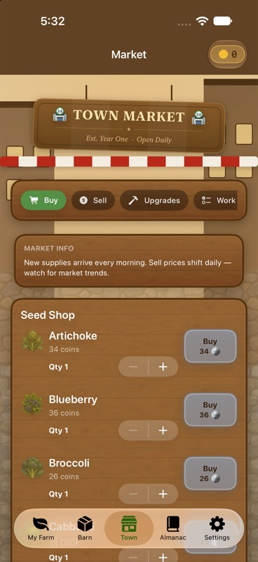
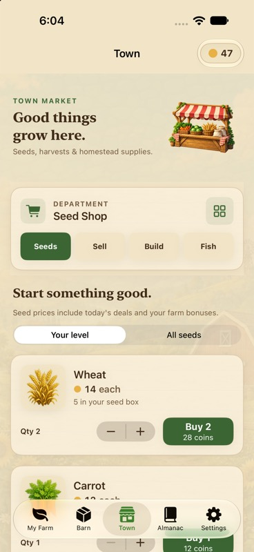
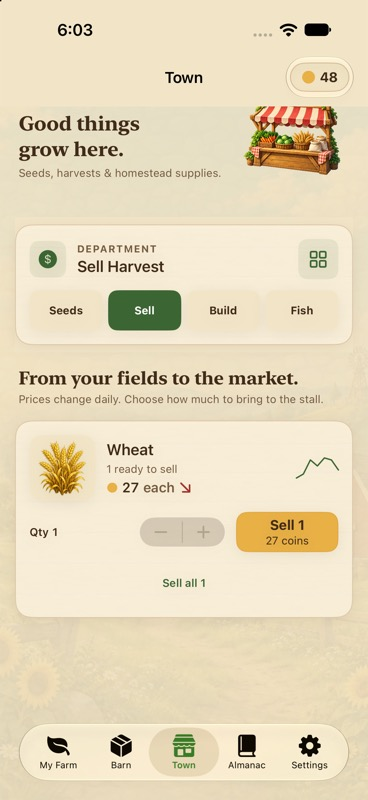
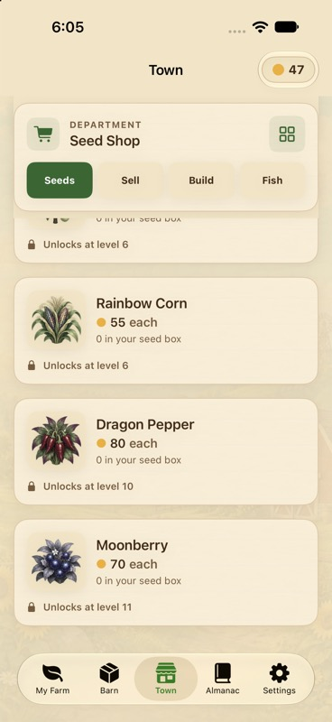

# Native Market redesign — 2026-10-02

The striped awning, timber and farm illustrations remain the visual direction. Town now uses cream cards, dark text, green purchase actions and gold sale actions. These captures come from the running iPhone 18 Pro / iOS 27 QA simulator; balances and progress belong to its diagnostic farm.

## 1. Inspect the existing Market

The previous narrow horizontal category strip made later departments difficult to reach. Locked seeds appeared first, dense wood rows obscured transaction details, and several light labels were difficult to read. Before captures also include Animals, Pets and Research.

## 2. Rebuild navigation and transaction cards

- A pinned department selector exposes all ten existing destinations, plus Seeds, Sell, Build and Fish shortcuts. Scrolling the full seed catalog keeps navigation visible.
- The Seed Shop defaults to usable choices, with wheat first and an All Seeds filter. Each card displays artwork, unit price, seed stock, quantity, total and affordability. Locked cards state their unlock level.
- Sell Harvest displays stock, unit quote, price trend, quantity and payout. Sell All retains confirmation; an empty basket explains the next action.
- All departments use the same readable cream/timber surfaces and enabled/disabled action styling. Completed and unavailable content retains readable text. Existing GameStore methods still own every transaction.
- The new transparent stall illustration appears in the Town header. Its source and all native artwork are recorded in the [asset catalog](../../../art-source/ios-v4/README.md).

## 3. Exercise the native workflows

Observed through computer input and direct simulator captures:

1. Continue opened the saved farm; its returning-player message dismissed normally.
2. Gathering the ready crop cleared its plot and produced one wheat in inventory. Existing milestone rewards also changed the wallet, so the harvest delta is not presented as a sale payout.
3. Sell All opened confirmation. Dismissing it preserved the wheat and 48-coin balance.
4. Selling one wheat at the displayed 27-coin quote changed the wallet from 48 to 75 and displayed the empty-basket state.
5. Increasing wheat quantity to two changed the quote to 28 coins. Purchasing changed the wallet from 75 to 47 and seed stock from three to five.
6. All Seeds showed locked crops; the selector remained pinned during scrolling.
7. Seed Shop, Sell Harvest, Upgrades, Work Orders, Tasks, Fishing, Pets, Animals, Research and Genetics were opened and inspected. This checks navigation and representative layouts, not every optional purchase or reward path.
8. A Fishing cast caught a Common Fish, added one entry to the catch log and paid 20 coins. Store tests separately cover one-time settlement and cancellation.
9. The final build installed and launched successfully. Relaunch retained 47 coins, five wheat seeds and the Common Fish log; the corrected Genetics symbol rendered.

Market primary/muted/action/status color tokens meet the test's 4.5:1 text contrast threshold. This does not establish complete screen or accessibility compliance. All 25 app tests passed with zero failures or skips. They verify seed ordering, available department symbols, readable Market color tokens, all bundled artwork and all 140 growth stages through the actual FarmScene renderer, plus real store and audio behavior. Final test/build results are recorded in [gameplay QA](../GAMEPLAY-QA.md).

Further inspected screens: [department menu](08-department-menu-after.jpg), [Upgrades](09-upgrades-after.jpg), [Work Orders](10-work-orders-after.jpg), [Tasks](11-tasks-after.jpg), [Pets](12-pets-after.jpg), [Animals](13-animals-after.jpg), [Research](14-research-after.jpg), [Genetics](15-genetics-after.jpg), [Fishing](16-fishing-after.jpg), [sale confirmation](17-sell-confirmation.jpg), [empty basket](18-empty-basket.jpg), [quantity quote](20-buy-quantity.jpg), and [catch result](21-fishing-catch.jpg).

## 4. Clean up the start menu

The requested “Cozy Living” subtitle is removed. Background geometry fills the entire screen, eliminating the gray bottom edge; buttons remain inside the safe area. Continue still works.

## Remaining coverage

Visual hierarchy, department reachability, transaction clarity and asset consistency improved in the inspected phone layout. VoiceOver journeys, large Dynamic Type, additional device sizes, physical-device memory/energy and every optional feature purchase remain unverified. Buildings and animals have card illustrations but are not new residents of the farm scene. No player reset or publication was performed.
