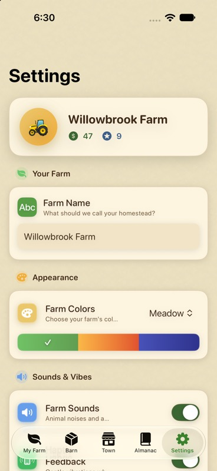
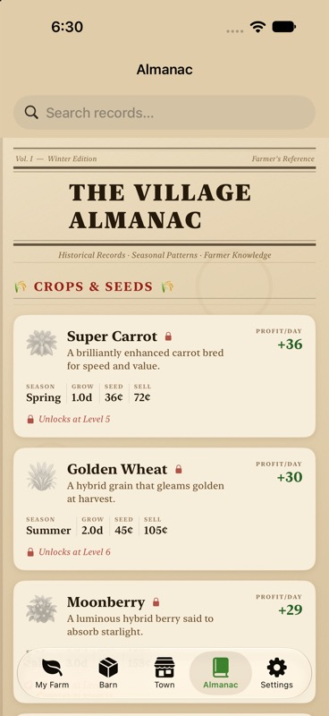

# Native Settings and Almanac polish — 2026-10-02

Simulator inspection exposed two readability issues outside the Market: Settings used white glass text on a light gradient, and its farm-name field was fixed at 130 points beside its label. Its custom toggle repeated the setting name inside the switch. Almanac used a dark navigation scheme over parchment, and its statistic headings were seven points.

## Settings

Settings now shares the Market's cream cards and dark text. The farm-name editor uses its own full-width field, retains the 32-character limit, trims names on commit and restores the saved name when submitted empty. Existing GameStore save intents are unchanged. Toggle rows draw the label once, and the leaf switch styling remains clear at a glance.

## Almanac

The Almanac retains its newspaper and parchment design. A light navigation scheme and warm accent make the native search controls readable. Crop statistic headings use the scaled caption style instead of seven-point fixed type.

## Verification

- Inspected both updated tabs on the running iPhone 18 Pro / iOS 27 simulator.
- The app built, installed and launched successfully after the changes.
- The complete native app suite passed: 25 tests, zero failures or skips. This includes GameStore, audio, artwork, Market contrast and department-symbol checks.
- The saved diagnostic farm kept its name, coins and inventory while navigating between tabs.
- VoiceOver, larger Dynamic Type sizes and physical devices remain untested.
